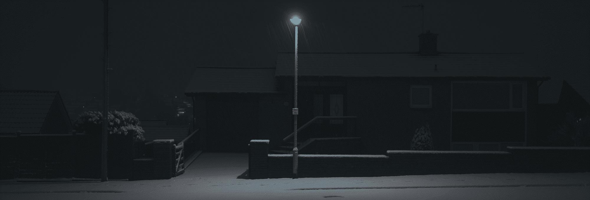
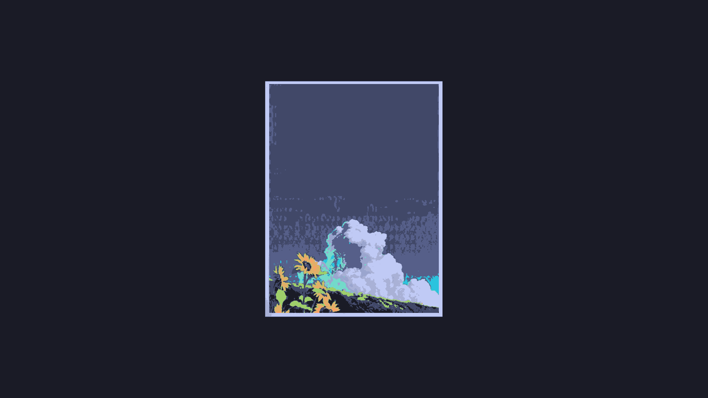
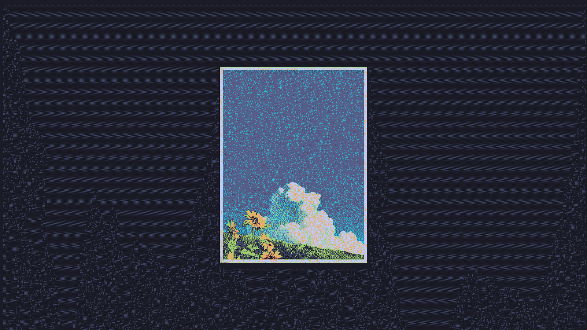

# Aster
> 🌼 Command line image colorizer utility.

Aster is a simple command line tool to recolor images into a specific palette.
If desired, Aster also includes a [shell](#aster-shell).


| Original                           | Recolored                     |
| ---------------------------------- | ----------------------------- |
|      |  |

> Made with this palette: *#0e1112 #181d1f #212629 #35383b #4e5256 #666b70 #181d1f #7f9aa3 #1c2124*

Aster relies purely on the Go standard library for the image colorization
process itself, including with Floyd-Steinberg dithering, so it's pretty fast.

# Features
- [x] Recolor images
  - [x] JPEG
  - [x] PNG
  - [ ] GIF
- [x] Dithering
  - [x] Floyd-Steinberg
  - [x] Atkinson
  - [x] Jarvis-Judice-Ninke
- [x] Invert lightness of image (colorizing or not)

# Install
## Prebuilt binaries
Go [here](https://nightly.link/TorchedSammy/Aster/workflows/build/master) for
builds on the master branch.

## Compile
People with Go installed can simply run the following command to install Aster:  
`go install github.com/TorchedSammy/Aster`  
It will be located at ~/go/bin/Aster or `$(go env GOPATH)/bin`, so add that to your `$PATH`.

Or, manually compile:  
```
git clone https://github.com/TorchedSammy/Aster
cd Aster
go get -d
go build
```

Now you will have an `Aster` binary. If you want it to be lowercase,
manually compile with -o for the name: `go build -o aster`

# Usage
See `aster -h` for usage and command line flags.  
Since typical usage is colorizing an image to a specific color palette,
an example of that would be: `aster -i in.png -o out.png -p "#000000 #ffffff"`,
which would colorize `in.png` to the black and white palette supplied by the
`-p` flag, and would output to `out.png`

Here is what that would look like with the [`wallpaper.png`](samples/wallpaper.png) sample,
using the VSCode Tokyo Night color scheme:  
| Image                      | Result                          |
| -------------------------- | ------------------------------- |
|  |  |

## Palettes
### Pywal
If you use pywal and would like your wallpaper to match your pywal color scheme,
you can supply the `-w` (or `--pywal`) flag and Aster will take the generated colors.

## Dithering
That result image before doesn't look that good, does it? To make the result look nicer
with a bit more detail, Aster can use Floyd-Steinberg dithering. Here's our new result:  
| Image                      | Result                                 |
| -------------------------- | -------------------------------------- |
|  |  |

There are a few other dithering algorithms supported. One of them is
Atkinson's. It provides higher contrast but washes away some parts, but
that looks better with this image. To do that, we can pass the `-D` flag
to supply the name of the algorithm. In this case, it would be `-D atkinson`
which gives us:
| Image                      | Result                                          |
| -------------------------- | ----------------------------------------------- |
|  |  |

One thing about dithering is that the image will look a bit noisy. That is how
dithering itself works. It's enabled by default due to it making the image look a lot better,
but you can disable it if you wish by making the flag false (`-d=false`).

## Lightness Invert
If needed, you can invert/swap the lightness of the image. This is done by converting
the RGB values of each pixel to HSL and subtracting the L (lightness) from 1.
This results in preservation of the hue and saturation.

This can be done with the `-s` flag.  

| Image                                                    | Result                                         | Result (Inverted)                              |
| -------------------------------------------------------- | ---------------------------------------------- | ---------------------------------------------- |
|  |  |  |

# Aster Shell
Bloom is a domain specific language made for Aster to run image filters.
Aster's shell mode uses Bloom to run commands. You can take a look at
a more detailed documentation of Bloom [here](bloom.md).

The basics of it is that you can start up an Aster shell and run
commands to make iterating on an image easier and faster.


# License
MIT
